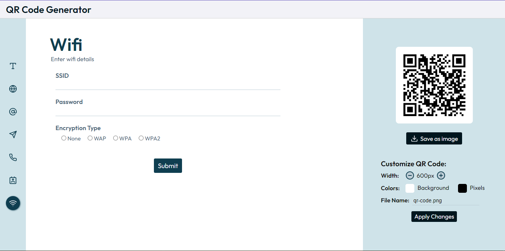

# QR Code Generator

Generate QR codes effortlessly. Qr Code Generator allows you to create QR codes for various purposes such as links, text, sms, wifi details, contact information, and more.



[Live Demo](https://the-qrcodegenerator.vercel.app/)

## Built With

- [React](https://reactjs.org/)
- [qrcode](https://github.com/soldair/node-qrcode)
- [Lucide Icons](https://lucide.dev/icons/)

### Installation

To run this project locally:

1. Clone the repository

   ```sh
   git clone https://github.com/ajoykumardas12/qr-code-generator.git
   ```

2. Navigate to the project directory

   ```sh
   cd qr-code-generator
   ```

3. Install packages

   ```sh
   npm install
   ```

4. Start the development server

   ```sh
   npm start
   ```

## Usage

- Choose the type of QR code you want to generate (URL, Text, Contact, etc.).
- Enter the relevant information.
- Click on the "Submit" button to create the QR code.
- Customize QR Code generation settings and "Apply Changes", now you can generate QR code with new customization.
